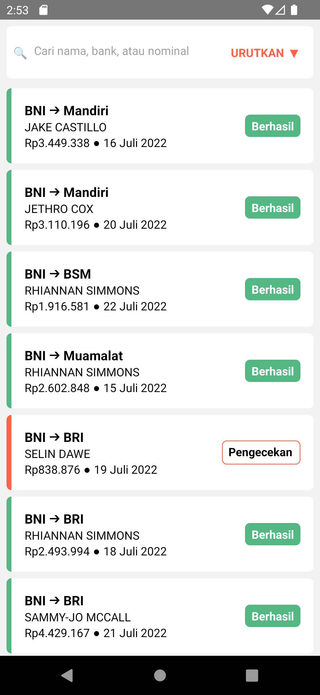
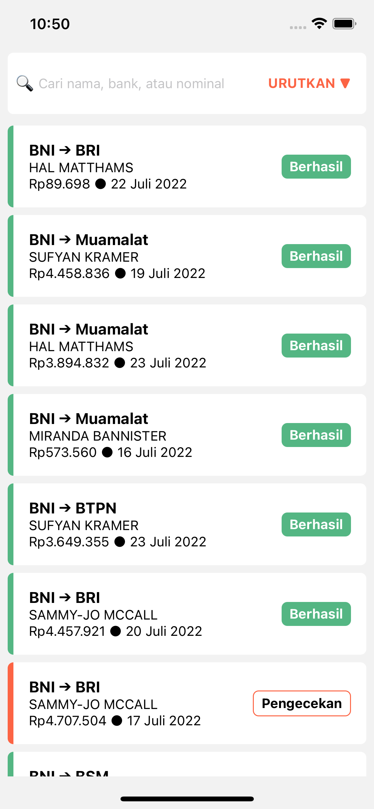
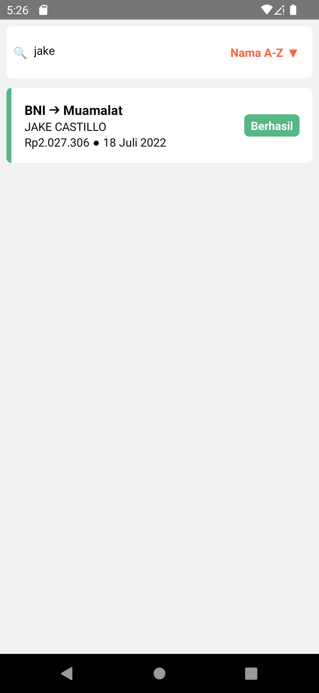
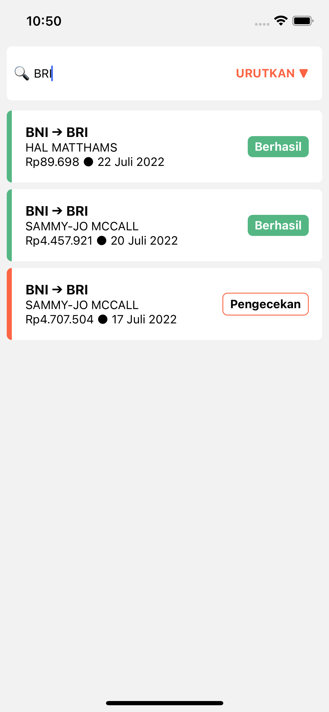
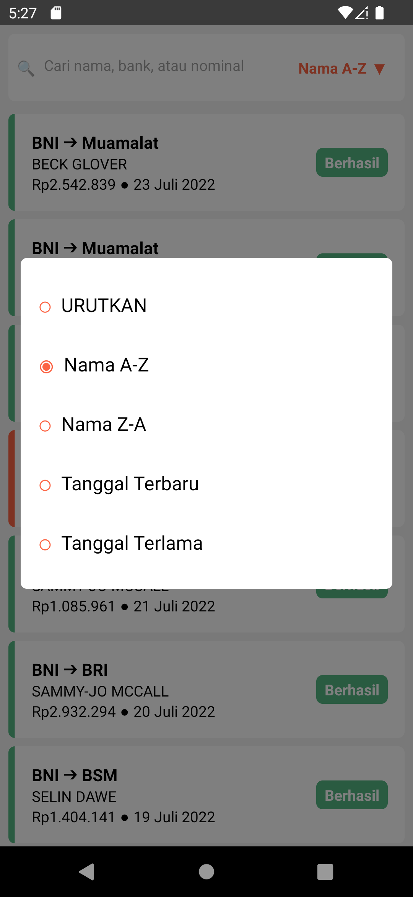
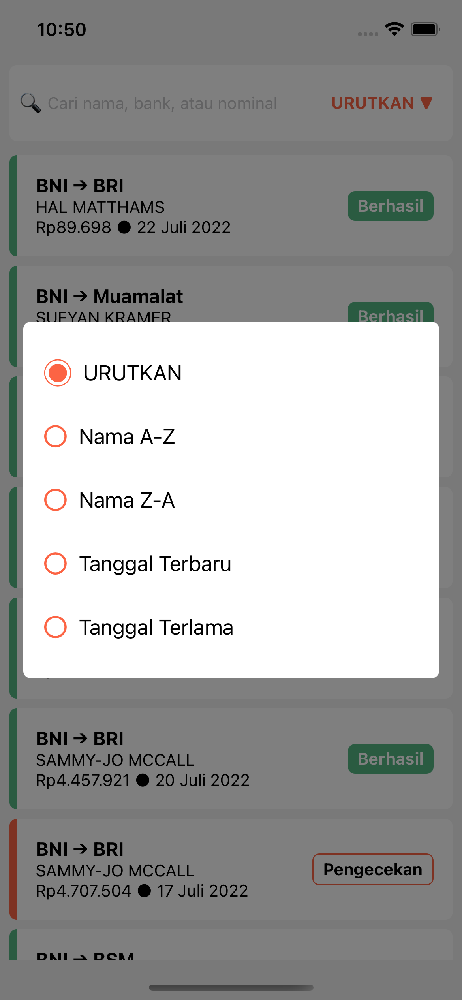
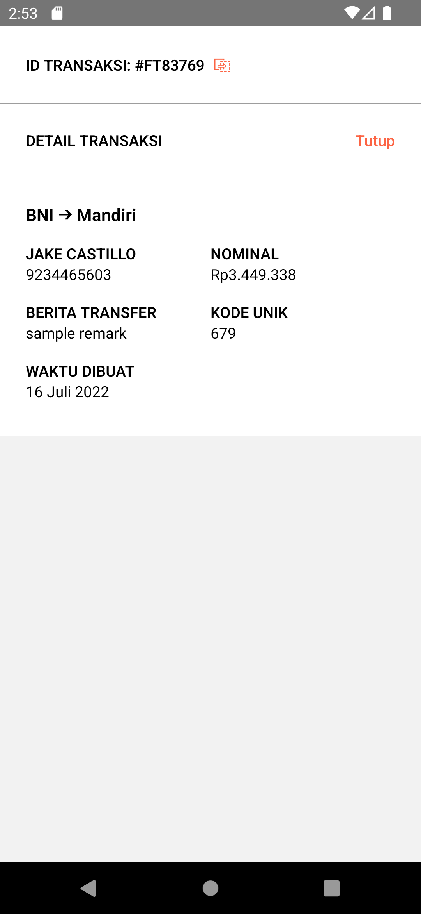
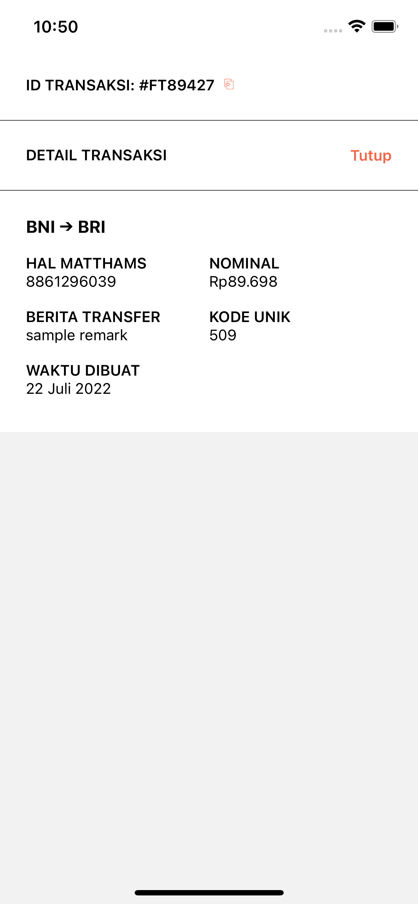

# Flip Transaction

An app to view transactions.

## Run Locally

Clone the project

```bash
  git clone https://github.com/aurisz/flip-transaction.git
```

Go to the project directory

```bash
  cd flip-transaction
```

Install dependencies

```bash
  yarn
```

Start the app (Android)

```bash
  yarn run android
```

Start the app (iOS)

```bash
  yarn run ios
```
## Features

- Filter transactions by
    - name
    - sender bank
    - beneficiary bank
    - transaction amount
- Sort transactions by
    - name (A - Z)
    - name (Z - A)
    - date newest
    - date oldest
- Pull to Refresh
- Copy Transaction ID to clipboard
## Optimizations


- Using [Jotai](https://jotai.org/) as minimal state management library
- Using `FlatList` instead `ScrollView` help with performance when rendering large amounts of data
- Enable [Hermes](https://reactnative.dev/docs/hermes) on Android for improved start-up time
- Debounced search input to prevent unnecessary re-renders
- Using `useMemo` to memoize conditional styling
- Add module resolver to help tidy up relative imports

## Screenshots

<table>
  <thead>
    <tr>
      <td>Android</td>
      <td>iOS</td>
    </tr>
  </thead>
  <tbody>
    <tr>
      <td>
        
      </td>
      <td>
        
      </td>
    </tr>
    <tr>
      <td>
        
      </td>
      <td>
        
      </td>
    </tr>
    <tr>
      <td>
         
      </td>
      <td>
        
      </td>
    </tr>
    <tr>
      <td>
        
      </td>
      <td>
        
      </td>
    </tr>
  </tbody>
</table>
